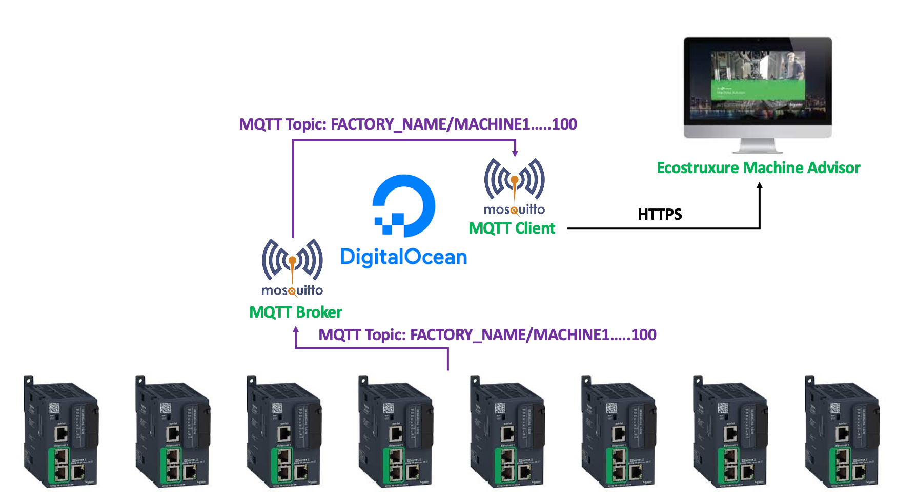

# mqtt-to-https-machine-advisor

## Content

1. [Introduction](#introduction)
2. [Configure and spin up droplet](#configure-and-spin-up-droplet)
3. [Create Machine Advisor Endpoint](#create-machine-advisor-endpoint)
4. [Setup and install MQTT broker](#setup-and-install-MQTT-broker)
5. [Deleting droplet](#deleting-droplet)


## Introduction

IOT is an up and coming trend in Industry 4.0 and Smart Manufacturing. In developing countries where majority of manufacturing are located in, budget for Industry 4.0 is limited. How do we implement IOT in a cost effective way? 

Schneider Electric Programmable Logic Controller (PLC) M241 and M251 is a cost effective solution to send data to the cloud for data collection, monitoring, analysis and machine learning. Below is a architecture of the solution.



Schneider Electric Programmable Logic Controller (PLC) M262 can send data directly and securely to a secure cloud server via MQTTs. This is a recommended cybersecured solution as it has build in encryption which prevents password sniffing, etc. 

However, for customers who are looking for temporary lower cost, optimal solution while looking to modernize their machines from M241/251 to M262, this architecture is still able to give you an option of sending data up to the cloud.

DigitalOcean also provides very cost effective solution for us to spin up a droplet, with cost going for as low as USD5/month (As of May 2021). 1 droplet can easily support up to 50-500 devices. However, further test still needs to be done. Contributions are definitely welcome.

This guide can be implemented in under 1 hour. I will upload a sample M251 PLC program for you to test. This guide is a quick tutorial on how to implement a simple IOT solution with off the shelf Schneider Electric IOT solution. 

I am not responsible for any loss of property or data from following this guide.

## Configure and spin up droplet

Create an account with [DigitalOcean](https://digitalocean.com), create, setup and configure the droplet as below. The cheapest plan is more than sufficient for 50 connected devices.


It is recommended to secure your droplet by enabling only ssh keys. Follow the guide by DigitalOcean to create a ssh keys.


Finish up your configuration by selecting the location of your droplet. You should probably choose a location closest to your connected devices. Spinning up the droplet will take between 1-2mins. Thereafter, copy the ip address of your droplet so that you can access it by ssh.


## Create Machine Advisor Endpoint

1. Create [Machine Advisor](https://ecostruxure-machine-advisor.se.app) account and create a machine by following video below.

[](https://www.youtube.com/watch?v=riQ2fUZWysM)

2. To configure the Machine Advisor Endpoint, go to the configuration page and select the following settings as below. Remember to save TOKEN in a secured location. This is the password required to pubish data to your Machine Advisor Endpoint, which is configured in paho-mqtt-client.py (machine_advisor_token). Server address will also be used in paho-mqtt-client.py (machine_advisor_url).


## Setup and install MQTT broker

1. Login to droplet via ssh.

```shell
ssh root@128.199.191.234
```

2. Install GIT so that you can clone mqtt-to-https-machine-advisor GIT repository.

```shell
yum -y install git
git clone https://github.com/kingsfall/mqtt-to-https-machine-advisor.git
```

3. Run bash script to install dependencies

```shell
 cd mqtt-to-https-machine-advisor/
 bash ./src/setup_droplet.sh
```

4. Start MQTT broker & configure MQTT broker to run on startup.

```shell
systemctl start mosquitto
systemctl enable mosquitto
```

5. Remove exisiting mosquitto.conf file.

```shell
rm -f /etc/mosquitto/mosquitto.conf
```

6. Configure MQTT broker USERNAME & PASSWORD

```shell
mosquitto_passwd -c /etc/mosquitto/passwd <USERNAME>
```

7. Reconfigure mosquitto.conf file to allow only login with password. Press Ctrl + C to exit file configuration.

```shell
cat > /etc/mosquitto/mosquitto.conf 
allow_anonymous false 
password_file /etc/mosquitto/passwd
```

8. Restart MQTT broker.

```shell
systemctl restart mosquitto
```

9. Install python libraries for MQTT client

```shell
pip3 install -r requirements.txt
```

10. modify paho-mqtt-client.py

```shell
vim ./src/paho-mqtt-client.py
```

Inside python code, you need to configure:
1. MQTT broker login credentials
2. Topic to subscribe
3. Machine Advisor Endpoints

For MQTT broker login credentials, we make changes to the code:
```python
# Key in MQTT broker information
broker_ipaddress = "localhost" # "localhost" if running broker and client in same machine
broker_portnumber = 1883 # default MQTT port number is 1883
broker_username = "username" # configure broker username
broker_password = "password" # configure broker password
```

For topics to subscribe, we make changes to the code:
```python
client.subscribe("FACTORY_NAME/MACHINE1") # subscribe based on required topic
client.subscribe("FACTORY_NAME/MACHINE2") # subscribe based on required topic
```
For Machine Advisor Endpoints, we make 2 changes to the code:
First, configure Machine Advisor Endpoints as an object/dictionary inside an array.
```python
machine_advisor_endpoints = [
    {
    "nickname": "ENDPOINT_NICKNAME1",
    "machine_advisor_token": "MACHINE_ADVISOR_TOKEN", # Remove Authorization; before keying into machine_advisor_token
    "machine_advisor_url": "https://cnm-ih-na.azure-devices.net/devices/urn:dev:ops:000000-EMA-prod-bec5acada1f6df13c6d0f31d/messages/events?api-version=2016-11-14"
},
    {
    "nickname": "ENDPOINT_NICKNAME2",
    "machine_advisor_token": "MACHINE_ADVISOR_TOKEN", # Remove Authorization; before keying into machine_advisor_token
    "machine_advisor_url": "https://cnm-ih-na.azure-devices.net/devices/urn:dev:ops:000000-EMA-prod-bec5acada1f6df13c6d0f31d/messages/events?api-version=2016-11-14"
}
]
```
To select the right Machine Advisor Endpoint for MQTT client to send to, we need to associate the subscribed topic to the endpoint.
```python
if "MACHINE1" in msg.topic: # associate topic based on machine_advisor_endpoints' array index
    index = 0
if "MACHINE2" in msg.topic: # associate topic based on machine_advisor_endpoints' array index
    index = 1
```

11. When you are done with the changes exit vim and start python script in [tmux](https://tmuxcheatsheet.com).
```
tmux create-session
```
Enter command below to run MQTT client once tmux is created. Tmux allows you to run command while ssh is disconnected.
```shell
python3 ./src/paho-mqtt-client.py
```
When MQTT client is successfully connected to MQTT broker, you should see output code below.
```
Connected with result code 0
```
When MQTT client successfully receives data from subscribed topic, you should see the message payload below.
```
FACTORY_NAME/MACHINE1 b'{"assetName":"M241","Variable1":99,"Variable1_timestamp":1622104416360,"Variable2":88,"Variable2_timestamp":1622104416360}'

FACTORY_NAME/MACHINE2 b'{"assetName":"M241","Variable1":99,"Variable1_timestamp":1622104416360,"Variable2":88,"Variable2_timestamp":1622104416360}'
```
When MQTT client successfully publishes to Machine Advisor, you should see the output code below.
```
Sending data to machine advisor endpoint: ENDPOINT_NICKNAME1
Machine Advisor Post Status Code: 204

Sending data to machine advisor endpoint: ENDPOINT_NICKNAME2
Machine Advisor Post Status Code: 204
```
When you see Machine Advisor Post Status Code: 204, it means it has successfully posted. Go to Machine Advisor Values & you should see the updated values.


## Deleting droplet

Make sure to delete your droplet or else DigitalOcean will continue to charge you even when your droplet is offline. To delete droplet, follow steps below.


